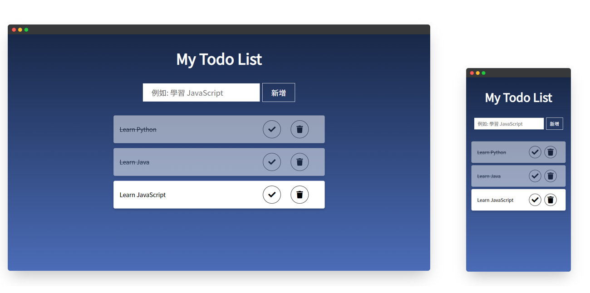

# JS-TodoList

<!--
*** Thanks for checking out the JS-TodoList. If you have a suggestion
*** that would make this better, please fork the repo and create a pull request
*** or simply open an issue with the tag "enhancement".
*** Thanks again! Now go create something AMAZING! :D
***
*** To avoid retyping too much info. Do a search and replace for the following:
*** github_username (that is "windsuzu"), repo_name (that is "JS-TodoList"), project_title, project_description
-->

<!-- [![Issues][issues-shield]][issues-url] -->
<!-- [![PR Welcome][pr-welcome-shield]](#contributing) -->
[![Contributors][contributors-shield]][contributors-url]
[![MIT License][license-shield]][license-url]
[![Author][author-shield]][author-url]
[![LinkedIn][linkedin-shield]][linkedin-url]

<!-- PROJECT LOGO -->
 

  

  <h3 align="center">JS-TodoList</h3>
  

    A todo list website built with plain JavaScript.
     
    <a href="https://windsuzu.github.io/JS-TodoList">View Demo</a>
    ·
    <a href="https://github.com/windsuzu/JS-TodoList/issues">Report Bug</a>
    ·
    <a href="https://github.com/windsuzu/JS-TodoList/issues">Request Feature</a>
  

Table of Contents

* [JS-TodoList](#js-todolist)
  * [About](#about)
  * [Features](#features)
  * [Preview](#preview)
  * [License](#license)
  * [Contact](#contact)
  * [Acknowledgements](#acknowledgements)

---

## About

<table>
<tr>
<td>

**JS-TodoList** 使用單純的 HTML, SCSS, JavaScript 來製作一個簡單又美觀的待辦清單網頁。

**JS-TodoList** 中使用單純的 JavaScript 來與 DOM (Document Object Model) 互動，包括建立、更新、刪除待辦事項的卡片、操控各種按鈕等。

網頁設計的部分也有使用 flex-box 與 media query 來完成響應式網頁設計 (RWD)。

Built With:

* HTML 5
* CSS 3
* SCSS
* JavaScript ES6

</td>
</tr>
</table>

## Features

* 基本框架設計
  * [HTML](https://github.com/windsuzu/JS-TodoList/blob/main/index.html#L23-L48)
  * [SCSS](https://github.com/windsuzu/JS-TodoList/blob/main/styles/style.scss#L1-L56)
* Todo 卡片樣式設計
  * [SCSS](https://github.com/windsuzu/JS-TodoList/blob/main/styles/style.scss#L58-L107)
  * [RWD - Media Query](https://github.com/windsuzu/JS-TodoList/blob/main/styles/style.scss#L119-L163)
  * [Animation](https://github.com/windsuzu/JS-TodoList/blob/main/styles/style.scss#L165-L179)
    * [ScaleUp](https://github.com/windsuzu/JS-TodoList/blob/main/styles/style.scss#L69)
    * [ScaleDown](https://github.com/windsuzu/JS-TodoList/blob/main/app.js#L60-L63)
* 新增 TODO 卡片 (非同步模擬)
  * [Button Event](https://github.com/windsuzu/JS-TodoList/blob/main/app.js#L7-L22)
  * [儲存至 localStorage ](https://github.com/windsuzu/JS-TodoList/blob/main/app.js#L75-L86)
  * [透過 DOM 建立 TODO 卡片](https://github.com/windsuzu/JS-TodoList/blob/main/app.js#L24-L44)
* 刪除 TODO 卡片 (非同步模擬)
  * [Button Event](https://github.com/windsuzu/JS-TodoList/blob/main/app.js#L53-L68)
  * [刪除並同步 localStorage](https://github.com/windsuzu/JS-TodoList/blob/main/app.js#L88-L105)
* [載入 TODO 卡片](https://github.com/windsuzu/JS-TodoList/blob/main/app.js#L107-L116)
* 更新 TODO 卡片
  * [Button Event](https://github.com/windsuzu/JS-TodoList/blob/main/app.js#L46-L51)
  * [更新並同步 localStorage](https://github.com/windsuzu/JS-TodoList/blob/main/app.js#L118-L125)

---

## Preview

---

## License

Distributed under the MIT License. See [LICENSE](https://github.com/windsuzu/JS-TodoList/blob/main/LICENSE) for more information.

## Contact

Reach out to the maintainer at one of the following places:

* [GitHub discussions](https://github.com/windsuzu/JS-TodoList/discussions)
* The email which is located [in GitHub profile](https://github.com/windsuzu)

## Acknowledgements

* [Wilson Ren](https://www.udemy.com/user/wilson-r-6/)
* <a href="https://www.flaticon.com/free-icons/check" title="check icons">Check icons created by Webalys - Flaticon</a>

[contributors-shield]: https://img.shields.io/github/contributors/windsuzu/JS-TodoList.svg?style=for-the-badge
[contributors-url]: https://github.com/windsuzu/JS-TodoList/graphs/contributors
[issues-shield]: https://img.shields.io/github/issues/windsuzu/JS-TodoList.svg?style=for-the-badge
[issues-url]: https://github.com/windsuzu/JS-TodoList/issues
[license-shield]: https://img.shields.io/github/license/windsuzu/JS-TodoList.svg?style=for-the-badge&label=license
[license-url]: https://github.com/windsuzu/JS-TodoList/blob/main/LICENSE
[linkedin-shield]: https://img.shields.io/badge/-LinkedIn-black.svg?style=for-the-badge&logo=linkedin&colorB=555
[linkedin-url]: https://linkedin.com/in/windsuzu
[pr-welcome-shield]: https://shields.io/badge/PRs-Welcome-ff69b4?style=for-the-badge
[author-shield]: https://shields.io/badge/Made_with_%E2%9D%A4_by-windsuzu-F4A92F?style=for-the-badge
[author-url]: https://github.com/windsuzu
